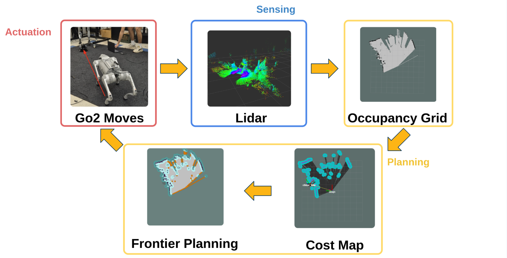
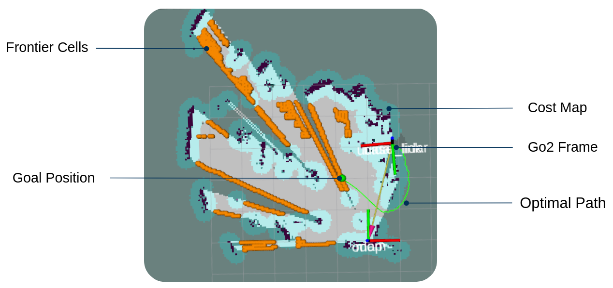
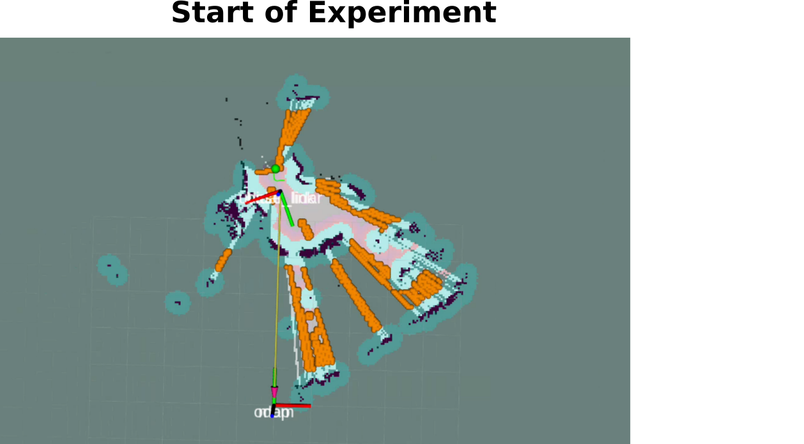
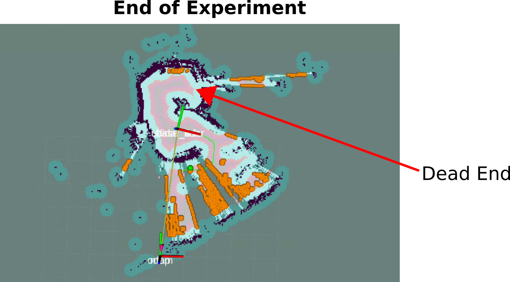

# Results

## Overview

This section presents the experimental results of the autonomous exploration pipeline operating on Unitree’s Go2 robot. The goal of these experiments was to evaluate the system’s ability to autonomously explore an unknown maze environment, map the maze using LiDAR, and navigate safely using frontier-based planning and the Navigation2 (Nav2) stack. Figure 1 shows the closed-loop perception-planning-actuation pipeline used throughout the experiments.

Figure 1: Closed-loop autonomous exploration pipeline. LiDAR sensing is used to build an occupancy grid, which is then converted into a Nav2 costmap. Frontier-based planning selects exploration goals, and Nav2 generates paths that are executed by the Go2 robot, closing the loop through continued sensing.

## Experimental Environment: Maze Setup

Experiments were conducted in an unknown indoor maze environment designed to evaluate autonomous exploration and navigation in confined spaces. The maze consists of a narrow corridor terminating in a dead end, providing a challenging test case for frontier-based exploration and path planning. No prior map information was provided to the system, and all exploration was performed online using LiDAR-based sensing and frontier-based planning. Video 1 shows the maze layout used in the experiments.

<video height="700px" controls>
  <source src="{{ '/assets/video/video_1.mp4' | relative_url }}" type="video/mp4">
  Your browser does not support the video tag.
</video>
This video shows the maze layout used in the experiments.

## Mapping Performance

The Go2 successfully built an occupancy grid of the maze environment using collected LiDAR data. As the robot traversed the corridor, unknown regions were converted into known free space, while obstacle boundaries became increasingly well-defined.

Early in exploration, large portions of the map remained unknown (Figure 3). As the robot navigated toward successive frontier points, the occupancy grid converged toward a more complete representation of the environment, including the corridor walls and the dead end (Figure 4). These results demonstrate that the sensing and mapping pipeline reliably captured the structure of the maze during autonomous exploration.

## Frontier-Based Exploration Behavior

Frontier points are boundaries between known free space and adjacent unknown regions in the occupancy grid. In the maze environment, frontiers primarily appeared at corridor ends and unexplored branches.

At each iteration, the system selected the closest valid frontier (using Euclidean distance) and evaluated its feasibility using Nav2’s path planner. Frontiers for which no collision-free path could be generated were rejected. This filtering step prevented the robot from committing to unreachable or unsafe exploration goals. Figure 2 illustrates detected frontier cells overlaid on the costmap, along with the selected goal and planned path.

Figure 2: Frontier-based planning visualization. Detected frontier cells are shown on the costmap, along with the selected goal position and Nav2-generated optimal path from the Go2’s current pose.

## Autonomous Navigation and Execution

Once a valid frontier was selected, the Go2 autonomously navigated toward the target using Nav2-generated paths. The robot successfully executed planned trajectories through the narrow corridor, safely avoiding obstacles while continuously updating its map, as shown in the video demonstrations (Videos 2 and 3).

As new LiDAR data was received during motion, the occupancy grid and costmap were updated online. This integration between sensing, planning, and actuation allowed the robot to maintain stable and reliable navigation throughout the exploration task.

Figure 3: System state at the start of the experiment, showing initial frontier locations and limited map knowledge.

Figure 4: System state at the end of the experiment. The robot has explored the corridor and identified the dead end, with no remaining reachable frontiers.

## Video Demonstrations

These videos demonstrate the system operating in real-time.

<video width="100%" controls>
  <source src="{{ '/assets/video/video_2.mp4' | relative_url }}" type="video/mp4">
  Your browser does not support the video tag.
</video>

This video shows the full closed-loop exploration pipeline in operation, including frontier detection, Nav2 path planning, and autonomous navigation through the maze.

<video height="700px" controls>
  <source src="{{ '/assets/video/video_3.mp4' | relative_url }}" type="video/mp4">
  Your browser does not support the video tag.
</video>

This video shows the exploration pipeline operating outside of the maze environment in an indoor setting, highlighting the system’s ability to generalize to a new environment.

## Summary of Results

In conclusion, these results show that the system:

* Constructed an accurate map of an unknown maze using LiDAR sensing  
* Chose the nearest frontier point to guide exploration  
* Safely navigated through confined spaces using Nav2 planning  
* Operated autonomously without prior map information

These results confirm that the perception-planning-actuation pipeline functioned as intended in a realistic search-and-rescue inspired environment.

## Limitations

Although the pipeline worked as intended in a smaller maze or office-scale environments, there are several limitations:

* **Limited support for dynamic environments:**  
  * After Nav2 constructs a path, the Go2 attempts to execute the planned trajectory even if the environment changes during execution. As a result, the current pipeline is not suitable for a dynamic environment.  
* **Map frame drift in large-scale navigation:**  
  * The map frame was configured to be the same as the odometry (odom) frame. This is sufficient for smaller environments, but this choice can lead to accumulated drift in large-scale navigation tasks, potentially reducing the long-term map accuracy.

